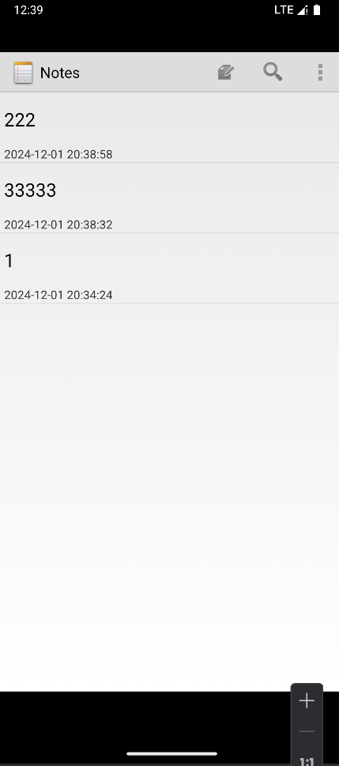
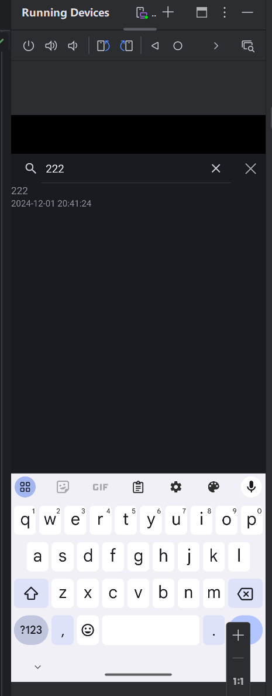
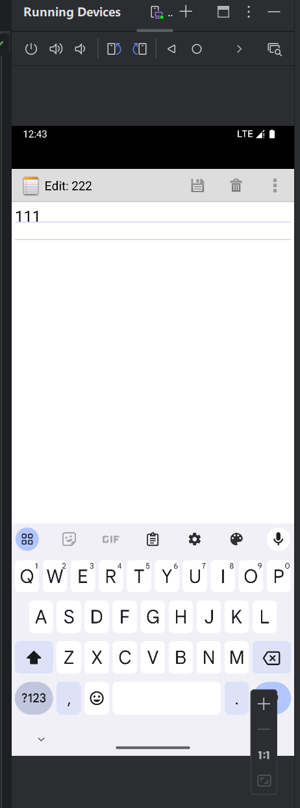
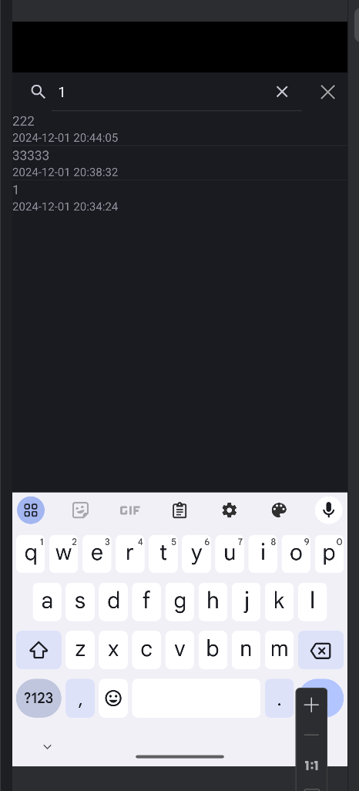
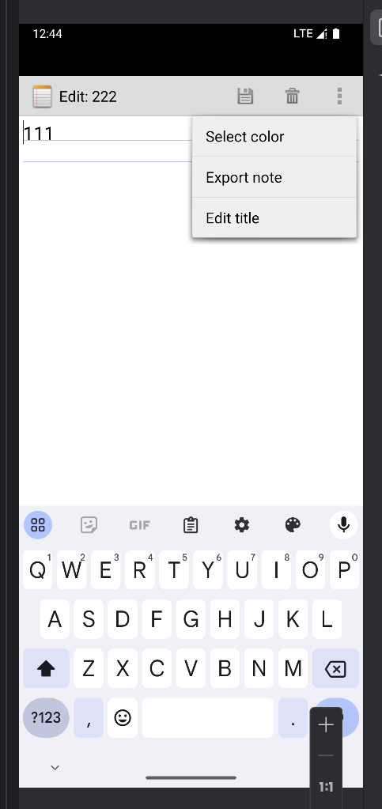
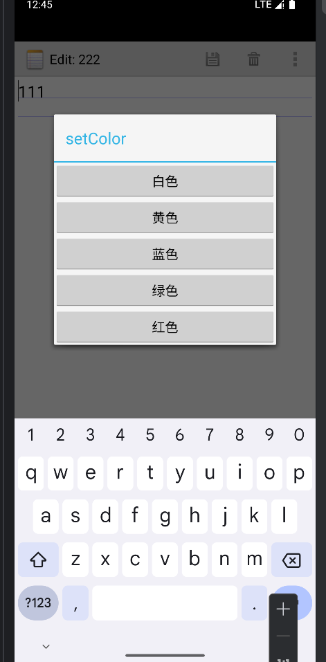
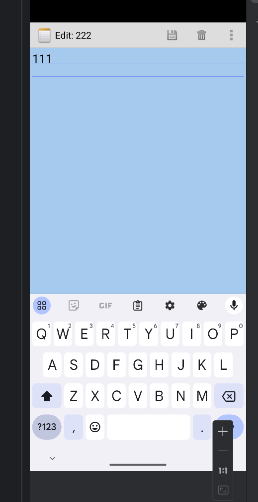
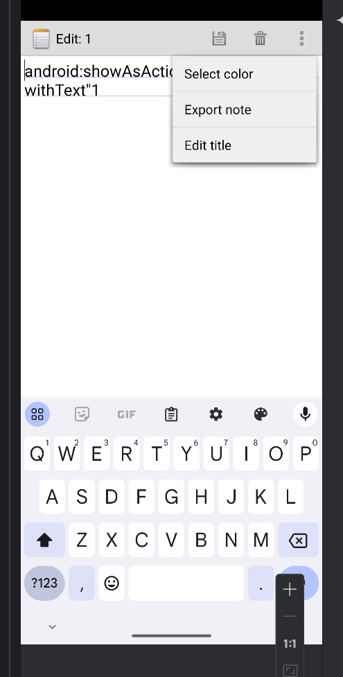
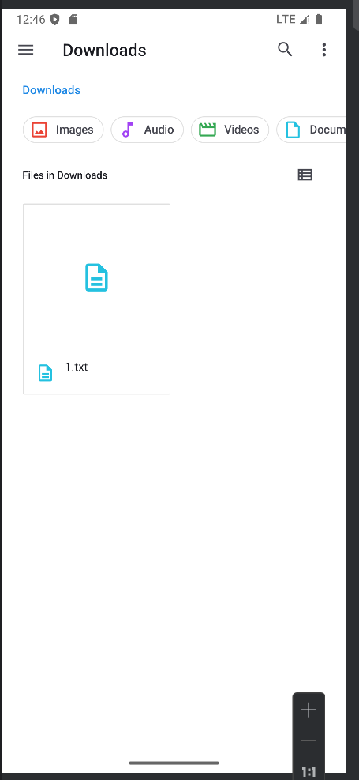
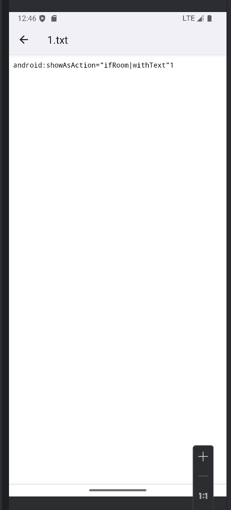

# Notepad期中项目

## 一、功能模块

### 1.时间戳功能



如图，创建一个笔记或者进入编辑保存以后，会按照动作的时间更新时间戳。


### 2.搜索功能







如图，可以根据标题搜索或者通过笔记内容模糊搜索，搜索框的×可以快速删除输入内容，搜索框外边的×可以快速关闭搜索界面回到主界面。

### 3.更改背景色功能（编辑界面背景色）







如图，在菜单功能项，点击Select color然后选择想要的颜色，保存后即可完成对背景色的修改

### 4.导出笔记内容







如图，点击菜单项选择Export note然后会直接把笔记以.txt形式导出到模拟器的File文件的download下

## 二、功能实现

### 1.时间戳代码逻辑

获取当前系统时间（以毫秒为单位的时间戳），并将其转换为指定格式（`yyyy-MM-dd HH:mm:ss`）的日期和时间字符串，最后将该格式化后的时间字符串存储到一个名为 `values` 的映射（例如可能是用于存储数据库表列值的 `Map`）中

### 2.搜索代码逻辑

实现了在一个安卓应用的笔记功能中的搜索功能。用户可以在 `SearchView` 中输入关键词，然后根据笔记的标题和内容进行模糊匹配搜索，将匹配的结果展示在 `ListView` 中，并能通过点击搜索结果项执行相应的操作，比如查看或编辑对应的笔记。

#### 搜索关键词提交处理（`onQueryTextSubmit`）

onQueryTextSubmit` 方法在用户输入搜索关键词并点击搜索按钮（如果有的话）时被调用

#### 搜索关键词变化处理（`onQueryTextChange`）

当用户在 `SearchView` 中输入或修改搜索关键词时，`onQueryTextChange` 方法会被调用，这是实现搜索功能的核心部分

### 3.修改背景色代码逻辑

实现了在安卓应用的笔记功能中，为笔记设置不同背景颜色的功能。用户可以在界面上选择白色、黄色、蓝色、绿色、红色等不同颜色作为笔记的背景色，选择后相应的颜色值会被保存到数据库中与该笔记对应的记录里，以便下次打开笔记时能显示设置好的背景色。

#### 获取当前背景色值（`onResume`方法）

onResume方法在 Activity从暂停状态恢复到前台运行时被调用，其执行顺序在 `onCreate 之后

#### 保存修改后的背景色值到数据库（`onPause`方法）

onPause 方法在 Activity即将暂停（比如用户切换到其他应用或者按了手机的返回键等情况）时被调用，其执行顺序在 `finish()` 之后

#### 设置背景色选择操作（`white`、`yellow`、`blue`、`green`、`blue`、`red`方法）

对于 white、yellow、blue、green、red 这些方法，它们分别对应着用户选择白色、黄色、蓝色、绿色、红色等不同颜色作为笔记背景色的操作。

### 4.导出笔记代码逻辑

将当前笔记的标题和内容导出为一个文本文件，并保存到设备的指定目录（这里修改为外部存储的 “Download” 目录）下。在导出过程中，会根据需要处理权限问题，确保能够成功写入文件，最后通过弹出提示消息告知用户导出操作的结果。

1. 获取笔记信息

   从数据库游标`mCursor`获取笔记标题，从文本视图组件`mText`获取笔记内容。

2. 生成文件名

   对笔记标题进行处理，把非字母数字字符替换为下划线，再加上 “.txt” 扩展名作为文件名。

3. 确定保存目录并创建（若不存在）

   以外部存储的 “Download” 目录作为目标，若该目录不存在则创建它。

4. 处理写入权限（安卓 6.0 及以上）

   若未获取写入外部存储权限，就向用户请求该权限，获取到权限后才能继续后续操作。

5. 写入文件并反馈结果

   在`try-catch`块中进行文件写入操作。若写入成功，弹出提示告知用户导出成功及文件位置；若出现`IOException`，打印异常堆栈信息并提示用户导出失败。
1. ## 三、代码实现

   ### 1.时间戳

   在PadProvider的insert中加入

   ```java
   Long now = Long.valueOf(System.currentTimeMillis());
   //修改 需要将毫秒数转换为时间的形式yy.MM.dd HH:mm:ss
   Date date = new Date(now);
   SimpleDateFormat simpleDateFormat = new SimpleDateFormat("yyyy-MM-dd HH:mm:ss");
   simpleDateFormat.setTimeZone(TimeZone.getTimeZone("Asia/Shanghai"));
   String dateFormat = simpleDateFormat.format(new Date(now));
   ```

在update中加入

```java
long now = System.currentTimeMillis();
Date date = new Date(now);
SimpleDateFormat simpleDateFormat = new SimpleDateFormat("yyyy-MM-dd HH:mm:ss");
simpleDateFormat.setTimeZone(TimeZone.getTimeZone("Asia/Shanghai"));
String dateFormat = simpleDateFormat.format(date);
```

在Editor的updateNote中加入

```java
long now = System.currentTimeMillis();
Date date = new Date(now);
SimpleDateFormat simpleDateFormat = new SimpleDateFormat("yyyy-MM-dd HH:mm:ss");
simpleDateFormat.setTimeZone(TimeZone.getTimeZone("Asia/Shanghai"));
String dateFormat = simpleDateFormat.format(date);
values.put(NotePad.Notes.COLUMN_NAME_MODIFICATION_DATE, dateFormat);
```

在需要的活动中加入映射并修改

```java
String[] dataColumns = { NotePad.Notes.COLUMN_NAME_TITLE, NotePad.Notes.COLUMN_NAME_MODIFICATION_DATE} ;//NotePad.Notes.COLUMN_NAME_NOTE?
// The view IDs that will display the cursor columns, initialized to the TextView in
// noteslist_item.xml
int[] viewIDs = { android.R.id.text1, R.id.text2};//加入修改时间
```

### 2.搜索功能

在活动List中加入搜索的case语句

```java
case R.id.menu_search:
    Intent intent = new Intent();
    intent.setClass(this, NoteSearch.class);
    this.startActivity(intent);
    return true;
```

新建一个Search的Activity来对SearchView文本变化设置监听

```java
package com.example.android.notepad;

import android.app.Activity;
import android.content.ContentUris;
import android.content.Intent;
import android.database.Cursor;
import android.database.sqlite.SQLiteDatabase;
import android.net.Uri;
import android.os.Bundle;
import android.view.View;
import android.view.Window;
import android.view.WindowManager;
import android.widget.AdapterView;
import android.widget.ImageView;
import android.widget.ListView;
import android.widget.SearchView;
import android.widget.SimpleCursorAdapter;

public class NoteSearch extends Activity implements SearchView.OnQueryTextListener {

    ListView listview;
    SQLiteDatabase sqLiteDatabase;
    private static final String[] PROJECTION = new String[]{
            NotePad.Notes._ID, // 0
            NotePad.Notes.COLUMN_NAME_TITLE, // 1
            NotePad.Notes.COLUMN_NAME_MODIFICATION_DATE // 修改时间
    };

    private SearchView searchView;
    private ImageView closeSearchIcon;

    @Override
    protected void onCreate(Bundle savedInstanceState) {
        super.onCreate(savedInstanceState);
        requestWindowFeature(Window.FEATURE_NO_TITLE);
        getWindow().setFlags(WindowManager.LayoutParams.FLAG_FULLSCREEN, WindowManager.LayoutParams.FLAG_FULLSCREEN);
        super.setContentView(R.layout.note_search);

        Intent intent = getIntent();
        if (intent.getData() == null) {
            intent.setData(NotePad.Notes.CONTENT_URI);
        }

        listview = (ListView) findViewById(R.id.list_view);
        sqLiteDatabase = new NotePadProvider.DatabaseHelper(this).getReadableDatabase();

        searchView = (SearchView) findViewById(R.id.search_view);
        searchView.setOnQueryTextListener(NoteSearch.this);

        // 获取关闭搜索的叉号图标视图
        closeSearchIcon = (ImageView) findViewById(R.id.close_search_icon);
        closeSearchIcon.setOnClickListener(new View.OnClickListener() {
            @Override
            public void onClick(View v) {
                // 关闭当前搜索界面，返回上一个页面或者执行其他你想要的操作
                // 这里示例为直接 finish() 关闭当前活动
                finish();
            }
        });

        listview.setOnItemClickListener(new AdapterView.OnItemClickListener() {
            @Override
            public void onItemClick(AdapterView<?> adapterView, View view, int i, long l) {
                Uri uri = ContentUris.withAppendedId(getIntent().getData(), l);
                String action = getIntent().getAction();
                if (Intent.ACTION_PICK.equals(action) || Intent.ACTION_GET_CONTENT.equals(action)) {
                    setResult(RESULT_OK, new Intent().setData(uri));
                } else {
                    startActivity(new Intent(Intent.ACTION_EDIT, uri));
                }
            }
        });
    }

    @Override
    public boolean onQueryTextSubmit(String query) {
        return true;
    }

    @Override
    public boolean onQueryTextChange(String newText) {
        Cursor cursor = sqLiteDatabase.query(
                NotePad.Notes.TABLE_NAME,
                PROJECTION,
                NotePad.Notes.COLUMN_NAME_TITLE + " like? or " + NotePad.Notes.COLUMN_NAME_NOTE + " like?",
                new String[]{"%" + newText + "%", "%" + newText + "%"},
                null,
                null,
                NotePad.Notes.DEFAULT_SORT_ORDER);

        int[] viewIDs = {R.id.text3, R.id.text4};
        SimpleCursorAdapter adapter = new SimpleCursorAdapter(
                NoteSearch.this,
                R.layout.searchlist_item,
                cursor,
                new String[]{NotePad.Notes.COLUMN_NAME_TITLE, NotePad.Notes.COLUMN_NAME_MODIFICATION_DATE},
                viewIDs
        );
        listview.setAdapter(adapter);
        return true;
    }
}
```
添加一个完整的搜索布局文件
<LinearLayout xmlns:android="http://schemas.android.com/apk/res/android"
    android:layout_width="match_parent"
    android:layout_height="match_parent"
    android:orientation="vertical">

    <RelativeLayout
        android:layout_width="match_parent"
        android:layout_height="wrap_content">

        <SearchView
            android:id="@+id/search_view"
            android:layout_width="0dp"
            android:layout_height="wrap_content"
            android:layout_alignParentLeft="true"
            android:layout_toLeftOf="@id/close_search_icon"
            android:queryHint="搜索"
            android:iconifiedByDefault="false"
            android:layout_weight="1" />

        <ImageView
            android:id="@+id/close_search_icon"
            android:layout_width="wrap_content"
            android:layout_height="wrap_content"
            android:layout_alignParentRight="true"
            android:layout_centerVertical="true"
            android:src="@android:drawable/ic_menu_close_clear_cancel"
            android:padding="8dp"
            android:clickable="true"
            android:focusable="true"
        />

    </RelativeLayout>

    <ListView
        android:id="@+id/list_view"
        android:layout_width="match_parent"
        android:layout_height="wrap_content">
    </ListView>

</LinearLayout>

### 3.设置编辑界面背景色

为了使记录保存首先在数据库中添加代码

```java
@Override
public void onCreate(SQLiteDatabase db) {
    db.execSQL("CREATE TABLE " + NotePad.Notes.TABLE_NAME + " ("
            + NotePad.Notes._ID + " INTEGER PRIMARY KEY,"
            + NotePad.Notes.COLUMN_NAME_TITLE + " TEXT,"
            + NotePad.Notes.COLUMN_NAME_NOTE + " TEXT,"
            + NotePad.Notes.COLUMN_NAME_CREATE_DATE + " INTEGER,"
            + NotePad.Notes.COLUMN_NAME_MODIFICATION_DATE + " INTEGER,"
            + NotePad.Notes.COLUMN_NAME_BACK_COLOR + " INTEGER" //颜色
            + ");");
}
```

在需要的映射加上color字段

```java
NotePad.Notes.COLUMN_NAME_BACK_COLOR
```

在Pad中加入静态方法

```java
public static final String COLUMN_NAME_BACK_COLOR = "color"
```

在Editor中的onResume方法中添加

```java
//读取颜色数据

if(mCursor!=null){

    mCursor.moveToFirst();

    int x = mCursor.getColumnIndex(NotePad.Notes.COLUMN_NAME_BACK_COLOR);

    int y = mCursor.getInt(x);

    Log.i("NoteEditor", "color"+y);

    switch (y){

        case NotePad.Notes.DEFAULT_COLOR:

            mText.setBackgroundColor(Color.rgb(255, 255, 255));

            break;

        case NotePad.Notes.YELLOW_COLOR:

            mText.setBackgroundColor(Color.rgb(247, 216, 133));

            break;

        case NotePad.Notes.BLUE_COLOR:

            mText.setBackgroundColor(Color.rgb(165, 202, 237));

            break;

        case NotePad.Notes.GREEN_COLOR:

            mText.setBackgroundColor(Color.rgb(161, 214, 174));

            break;

        case NotePad.Notes.RED_COLOR:

            mText.setBackgroundColor(Color.rgb(244, 149, 133));

            break;

        default:

            mText.setBackgroundColor(Color.rgb(255, 255, 255));

            break;

    }

}
```

在Editor中的onOptionsItemSelected方法中添加

```java
// 换背景颜色选项
case R.id.background_select:

    Intent intent = new Intent(null,mUri);

    intent.setClass(NoteEditor.this,NoteBackgroundSet.class);

    NoteEditor.this.startActivity(intent);

    break;
```

新建一个BackgroundSet的Activity活动来响应

```java
public class NoteBackgroundSet extends Activity {

    private Cursor mCursor;
    private Uri mUri;
    private int color;
    private static final int COLUMN_INDEX_TITLE = 1;
    private static final String[] PROJECTION = new String[] {
            NotePad.Notes._ID, // 0
            NotePad.Notes.COLUMN_NAME_BACK_COLOR,
    };
    public void onCreate(Bundle savedInstanceState) {
        super.onCreate(savedInstanceState);
        setContentView(R.layout.note_color);
        //从NoteEditor传入的uri
        mUri = getIntent().getData();
        mCursor = managedQuery(
                mUri,        // The URI for the note that is to be retrieved.
                PROJECTION,  // The columns to retrieve
                null,        // No selection criteria are used, so no where columns are needed.
                null,        // No where columns are used, so no where values are needed.
                null         // No sort order is needed.
        );
    }
    @Override
    protected void onResume(){
        //执行顺序在onCreate之后
        if (mCursor != null) {
            mCursor.moveToFirst();
            color = mCursor.getInt(COLUMN_INDEX_TITLE);
        }
        super.onResume();
    }
    @Override
    protected void onPause() {
        //执行顺序在finish()之后，将选择的颜色存入数据库
        super.onPause();
        ContentValues values = new ContentValues();
        values.put(NotePad.Notes.COLUMN_NAME_BACK_COLOR, color);
        getContentResolver().update(mUri, values, null, null);
    }
    public void white(View view){
        color = NotePad.Notes.DEFAULT_COLOR;
        finish();
    }
    public void yellow(View view){
        color = NotePad.Notes.YELLOW_COLOR;
        finish();
    }
    public void blue(View view){
        color = NotePad.Notes.BLUE_COLOR;
        finish();
    }
    public void green(View view){
        color = NotePad.Notes.GREEN_COLOR;
        finish();
    }
    public void red(View view){
        color = NotePad.Notes.RED_COLOR;
        finish();
    }

}
```

### 4.导出文件

在Editor的onOptionsItemSelected方法中添加

```java
case R.id.menu_export:
    exportNote();
    break;
```

然后直接在Editor里写入一个导出的方法并指定导出到download文件里

```java
private void exportNote() {
    String title = mCursor.getString(mCursor.getColumnIndex(NotePad.Notes.COLUMN_NAME_TITLE));
    String content = mText.getText().toString();

    // Create a file name
    String fileName = title.replaceAll("[^a-zA-Z0-9]", "_") + ".txt";

    // Get the desktop directory
    File dir = new File(Environment.getExternalStorageDirectory(), "Download"); // 修改这里
    if (!dir.exists()) {
        dir.mkdirs();
    }

    // Create a file
    File file = new File(dir, fileName);

    if (Build.VERSION.SDK_INT >= Build.VERSION_CODES.M) {
        if (checkSelfPermission(Manifest.permission.WRITE_EXTERNAL_STORAGE) != PackageManager.PERMISSION_GRANTED) {
            requestPermissions(new String[]{Manifest.permission.WRITE_EXTERNAL_STORAGE}, REQUEST_WRITE_STORAGE);
            return;
        }
    }
    try {
        // Write the note content to the file
        FileOutputStream fos = new FileOutputStream(file);
        fos.write(content.getBytes());
        fos.close();

        // Show a toast message
        Toast.makeText(this, "Note exported to " + file.getAbsolutePath(), Toast.LENGTH_LONG).show();
    } catch (IOException e) {
        e.printStackTrace();
        Toast.makeText(this, "Failed to export note", Toast.LENGTH_SHORT).show();
    }
}
```
在fest文件中加入权限

```java
<uses-permission android:name="android.permission.WRITE_EXTERNAL_STORAGE" />
<uses-permission android:name="android.permission.READ_EXTERNAL_STORAGE" />
```


